# Google Deployment Manager

Made for CDS DS 561: Cloud Computing  
Professor: [Leonidas Kontothanassis](https://www.bu.edu/cds-faculty/profile/kthanasi/)

---

An example of using Google Deployment Manager to replicate two of the previous homeworks: homework 2 and homework 5. This assignment consists of two components: a bucket containing the code for the web server, subscriber client, and the mini-web generator and a GDM deployment config which covers the creation of service accounts, Pub/Sub topics and subscriptions, CloudSQL instances and databases, IAM permissions, firewall rules, GCE IPs, and GCE VMs.

## Sections

- [Setup](#setup)
- [Screenshots](#screenshots)
  - [Requests](#requests)
  - [Created Resources](#created-resources)
  - [Deleted Resources](#deleted-resources)

## Setup

### Prerequisites

This assignment assumes you have completed homeworks 2 and 5 and have the files available for upload to a manually created bucket. If not, see the [README](../assignment-2/README.md) for homework 2 and the [README](../assignment-5/README.md) for homework 5.

### Steps

1. Create a bucket for your code
   ```bash
   gsutil mb gs://<code-bucket-name>
   ```
1. Upload the `web-server` and `sub-client` directories to the bucket
   ```bash
   gsutil cp -r web-server gs://<code-bucket-name>
   gsutil cp -r sub-client gs://<code-bucket-name>
   ```
1. Update `deployment.yml` to reflect your project's information.

   - Replace all instances of `ds561-amahr` with your project ID.
   - Update `iam-policy-binding-main-bucket`'s bucket property to reflect your code bucket's name.

1. Run `gcloud deployment-manager deployments create <deployment-name> --config deployment.yml` to create all of the resources.

1. (When finished) Delete the mini web bucket (due to it not being empty) and the deployment.
   ```bash
   gsutil -m rm -r gs://<code-bucket-name>
   gcloud deployment-manager deployments delete <deployment-name>
   ```

## Screenshots

### Requests

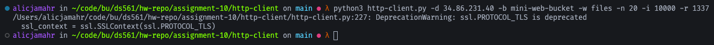

cURL 200 response:

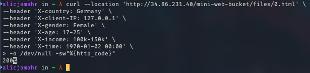

cURL 404 response:

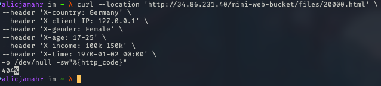

cURL 501 response:

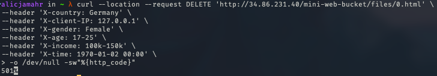

`requests` table contents:

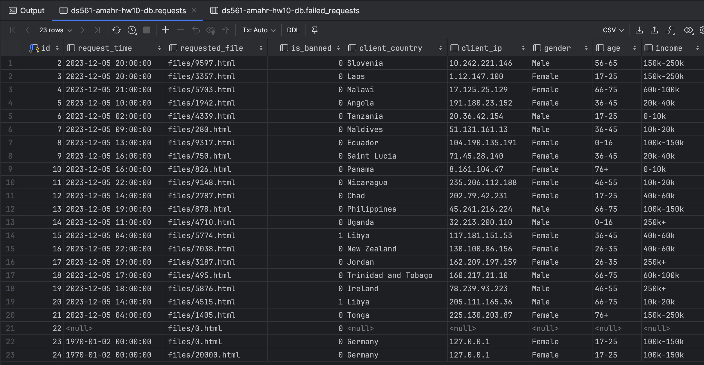

`failed_requests` table contents:

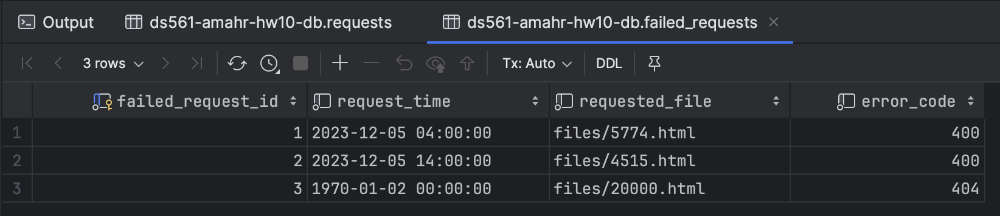

Pub/Sub listener:

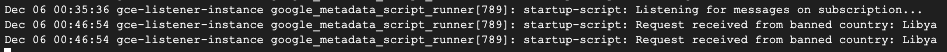

### Created Resources

Created service account:

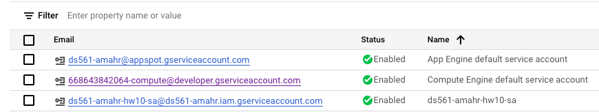

Created Bucket:


Created SQL instance:

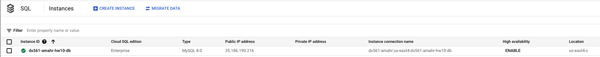

Created SQL database:

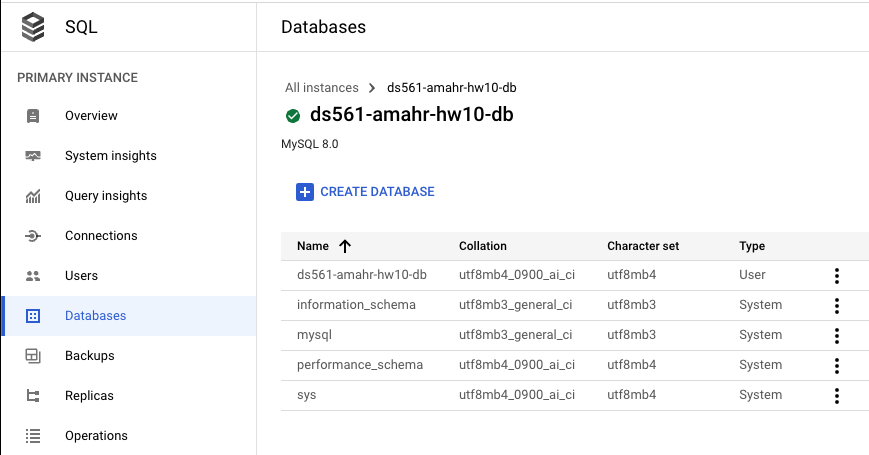

Created Pub/Sub topic:

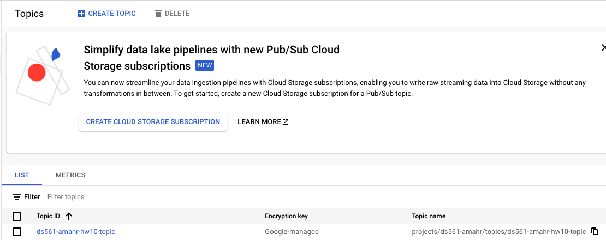

Created Pub/Sub subscription:

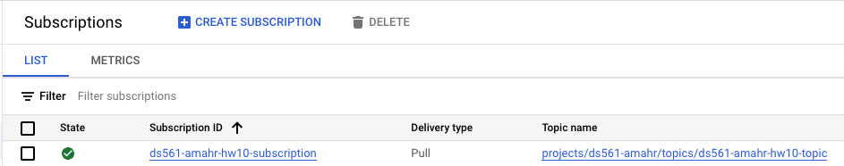

Created IAM permissions:

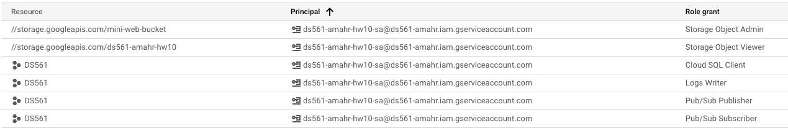

Created firewall rule:

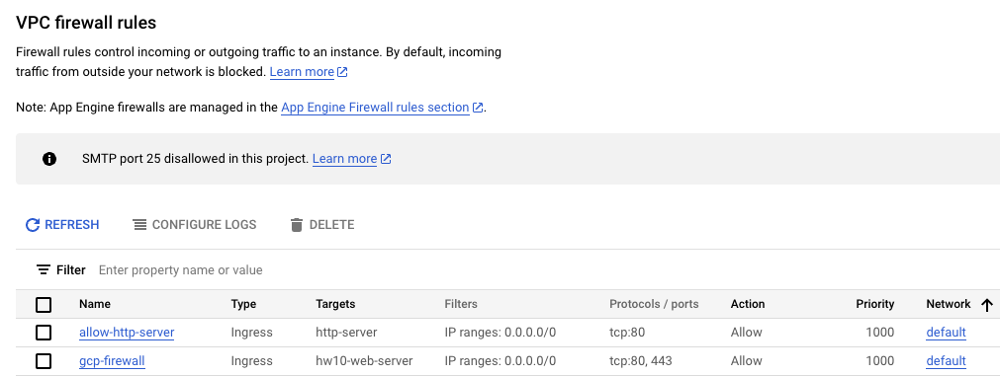

Created GCE IP:

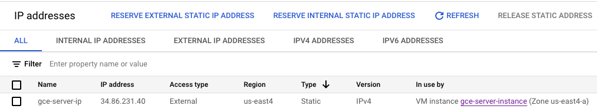

Created GCE VMs:

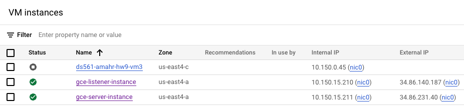

### Deleted Resources

Deleted Service Account:

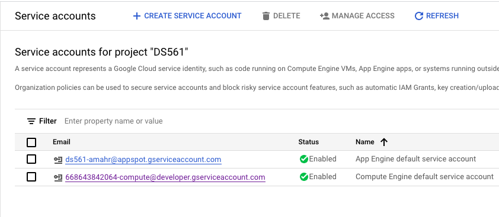

Deleted Bucket:

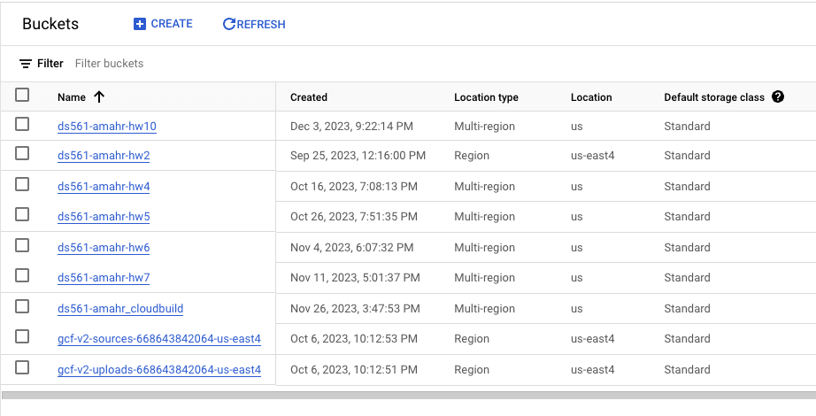

Deleted SQL instance:

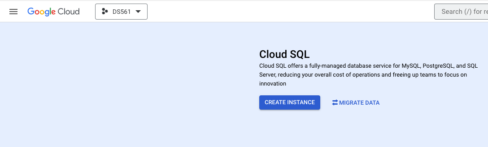

Deleted Pub/Sub topic:

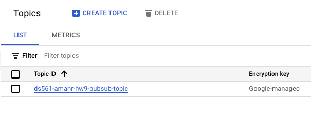

Deleted Pub/Sub subscription:

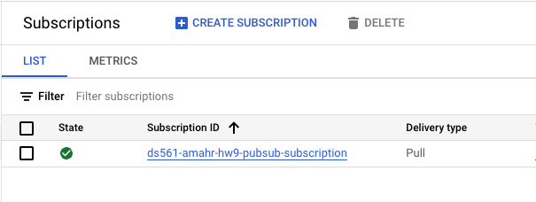

Deleted Firewall rule:

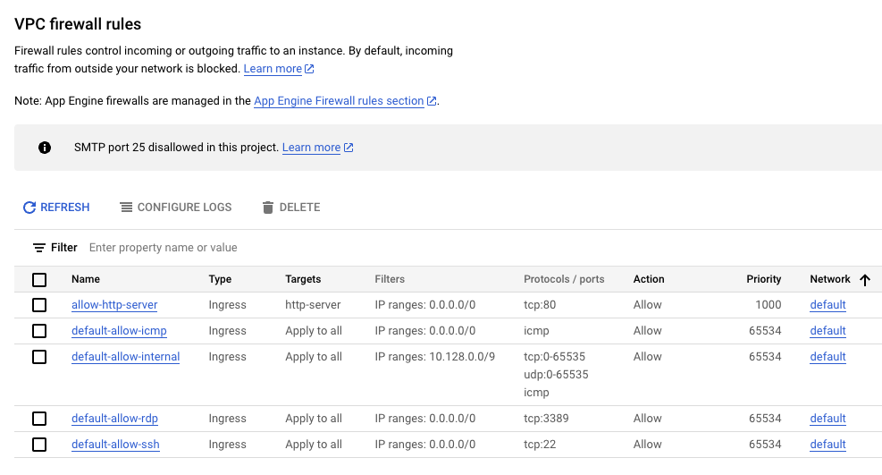

Deleted GCE IP:

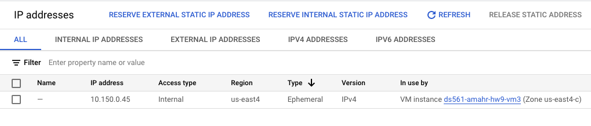

Deleted GCE VMs:

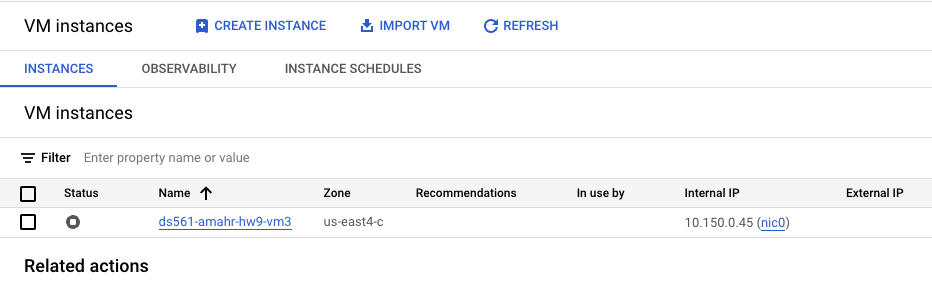
