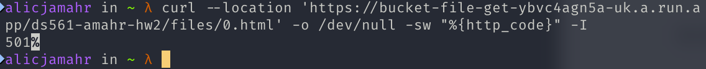
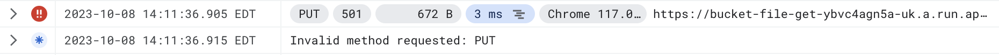
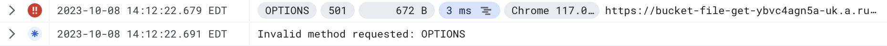

# GCP Cloud Functions and Pub/Sub

## [GitHub](https://github.com/braxton/GCP-Cloud-Fn-PubSub)

Made for CDS DS 561: Cloud Computing  
Professor: [Leonidas Kontothanassis](https://www.bu.edu/cds-faculty/profile/kthanasi/)

---

An example of using GCP Cloud Functions, Storage Buckets, and Pub/Sub to create a simple fetch endpoint that returns the contents of a file in a GCP Storage Bucket while communicating requests from banned countries to another process.

## Sections

- [Setup](#setup)
- [Usage](#usage)
- [Screenshots](#screenshots)

## Setup

These instructions assume that the user has successfully completed homework 2 and has a functional GCP project with a storage bucket filled with files.

### Pub/Sub

1. Create a service account:

```
gcloud iam service-accounts create <service-account-name> --display-name <service-account-display-name>
```

2. Create a key for the service account and download it as a JSON file:

```
gcloud iam service-accounts keys create <key-name>.json --iam-account <service-account-email>
```

3. Create a topic in Pub/Sub. This can be done by running the following commands in the terminal:

```bash
gcloud pubsub topics create <topic-name>
```

4. Create a subscription for the topic. This can be done by running the following commands in the terminal:

```bash
gcloud pubsub subscriptions create <subscription-name> --topic <topic-name>
```

5. On the subscription, add the service account as a Principal with the Pub/Sub Admin role (roles/pubsub.admin):

```bash
gcloud pubsub subscriptions add-iam-policy-binding <subscription-name> --member serviceAccount:<service-account-email> --role roles/pubsub.admin
```

### Cloud Function - App 1

1. Update `app1/main.py`'s `PROJECT_ID` and `TOPIC_ID` variables with the appropriate values.

### Local Client - App 2

1. Place the JSON key file created in the Pub/Sub section in the `app2` directory.

## Usage

Usage can vary depending on if you are running everything locally or through GCP.

### Local

1. Install the requirements present in requirements.txt:

```bash
pip install -r requirements.txt
```

2. In one terminal tab, start App1 locally:

```bash
cd app1
functions-framework --target=bucket_file_get
```

3. In another terminal tab, start App2 locally:

```bash
cd app2
python main.py --project_id <project-id> --subscription_id <subscription-id> --service_acct_json <service-account-json-file>
```

An example of the second command would be:

```bash
python3 main.py --project_id ds561-amahr --subscription_id banned-countries-sub --service_acct_json ds561-amahr-7687738fe441.json
```

4. In a third terminal tab, run the provided http client:

```bash
python3 http-client.py -d 127.0.0.1 -p 8080 -b <bucket-name> [-w <bucket-subdir-name>] -n <number-of-files> -i <total-number-of-files> [-v]
```

An example of the command would be:

```bash
python3 http-client.py -d 127.0.0.1 -p 8080 -b ds561-bmahr-hw2 -w files -n 10 -i 10000 -v
```

### GCP

1. Deploy App1 to GCP:

This can be done by running the following commands in the terminal:

```bash
cd app1
chmod +x deploy.sh
./deploy.sh
```

Make note of the URI under `serviceConfig.uri` that is output in the terminal. This will be used later. Alternatively, you can get the URI from `gcloud`:

```bash
gcloud functions describe <cloud-function-name> --gen2 --region <region> --format="value(serviceConfig.uri)"
```

If you used the provided `deploy.sh` script, the region is `us-east4`

2. Install the dependencies for the project:

```bash
pip install -r requirements.txt
```

3. In one terminal tab, run App2 Locally:

```bash
cd app2
python main.py --project_id <project-id> --subscription_id <subscription-id> --service_acct_json <service-account-json-file>
```

An example of the second command would be:

```bash
python3 main.py --project_id ds561-amahr --subscription_id banned-countries-sub --service_acct_json ds561-amahr-7687738fe441.json
```

4. In another terminal tab, run the provided HTTP client:

For the sake of clarity, `<cloud-function-url>` is defined as the URI of the deployed Cloud Function without HTTP(S)

```bash
python3 http-client.py -d <cloud-function-uri> -b /<bucket-name> [-w <bucket-subdir-name>] -n <number-of-files> -i <total-number-of-files> -s [-v]
```

An example of the command would be:

```bash
python3 http-client.py -d bucket-file-get-ybvc4agn5a-uk.a.run.app -b /ds561-amahr-hw2 -w files -n 1000 -i 10000 -s
```

## Screenshots

### Part 4

For the sake of time (and my lack of screen space), I only requested 3 files and did not include the `-v` flag.


To request hundreds of files as stated, the following version of the command could be used:

```bash
python3 http-client.py -d bucket-file-get-ybvc4agn5a-uk.a.run.app -b /ds561-amahr-hw2 -w files -n 500 -i 10000 -s -v
```

### Part 5

404 Error:


501 Error - Put:


501 Error - Delete:


501 Error - Head:



501 Error - Connect:

_(As we do not have a proxy, our CONNECT request is returned with a 400 code by GCP)_


501 Error - Options:


501 Error - Trace:

_(GCP intercepts the TRACE request before it reaches our service, so it returns a 405)_


501 Error - Patch:


### Part 6

200 Response:


404 Error:


501 Error - Put:



501 Error - Post:


501 Error - Delete:


501 Error - Head:


501 Error - Connect:

_(CONNECT is not supported by the v8 JS Engine)_


501 Error - Options:



501 Error - Trace:

_(TRACE is not supported by the v8 JS Engine)_


501 Error - Patch:


### Part 7

Request:


Local (App 2):


Cloud Logging:

