# GCP Pub/Sub and VMs

Made for CDS DS 561: Cloud Computing  
Professor: [Leonidas Kontothanassis](https://www.bu.edu/cds-faculty/profile/kthanasi/)

---

An example of using GCE VMs and Pub/Sub to create an isolated distributed system. The system consists of a single publisher VM which hosts a web server as well as a single receiver VM which subscribes to the publisher's topic. The publisher VM is able to receive HTTP requests and publish them to the topic if they come from a banned country. The receiver VM is able to receive the published messages and print them to the console. An additional VM is used to stress test the publisher VM by sending a large number of requests.

## Sections

- [Setup](#setup)
- [Screenshots](#screenshots)

## Setup

### Prerequisites

This assignment assumes your local computer has `gcloud` installed and authenticated. It also assumes you have completed the previous homeworks and have the files available for manual upload to the stress testing VM (hereby VM 2) and the subscriber VM (hereby VM 3).

### Steps - General

1. Update `scripts/bash_vars.sh` with the appropriate values. `GCP_PROJECT` and `LINK_FILES_BUCKET_NAME` are the only variables that depend on the previous homeworks.
2. Update `scripts/vm_startup.sh` with the appropriate values. `GCP_PROJECT_ID` and `GCP_PUBSUB_TOPIC_ID` come from your `scripts/bash_vars.sh` file.
3. Run `CREATE_AUX_VMS=true scripts/create_everything.sh` to create the service account, bucket, Pub/Sub topic and subscription, and the VMs (`CREATE_AUX_VMS` creates VM 2 and VM 3). This will also automatically handle the file transfer to the VMs and granting the appropriate permissions to the service account. **NOTE:** This will create all three VMs with the same service account.
4. (Later) When finished with the assignment, run `scripts/delete_everything.sh` to delete the VMs, Pub/Sub topic and subscription, and the service account. Note that it **will not** delete VM 2 and VM 3. This is because they are assumed to have manually uploaded files and cannot be completely recreated using `scripts/create_everything.sh`.

### Steps - VM 2

1. SSH into VM 2.
2. Upload the HTTP client from Homework 3.
3. Install the necessary dependencies for the HTTP client.
4. Create a bash script to run 100s of instances of the HTTP client:

```bash
for i in {1..400}
do
    # Run your Python Script on this line with an & at the end
    echo "Starting client $i"
done
```

For example:

```bash
for i in {1..400}
do
    python3 main.py -d 34.86.210.1 -b /ds561-amahr-hw2 -w files -n 500 -i 10000 &
    echo "Starting client $i"
done
```

5. Run `chmod +x` on the bash script to make it executable.
6. Run the bash script.
7. Pay attention to the cloud logging output of VM 1. Note when it states that it is no longer receiving connections due to the high volume of requests.

### Steps - VM 3

1. SSH into VM 3.
2. Upload and configure the Pub/Sub subscriber from Homework 3.
3. Install the necessary dependencies for the subscriber.
4. Run the subscriber.

## Screenshots

### Part 4

For the sake of time (and my lack of screen space), I only requested 3 files and did not include the `-v` flag.

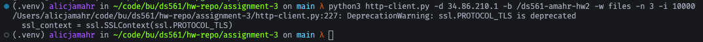

To request hundreds of files as stated, the following version of the command could be used:

```bash
python3 http-client.py -d 34.86.210.1 -b /ds561-amahr-hw2 -w files -n 500 -i 10000 -v
```

### Part 5

404 Error:
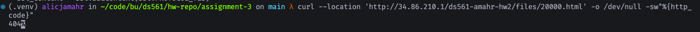


501 Error:
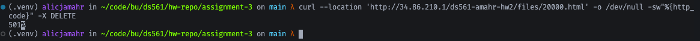


### Part 6

200 Response:
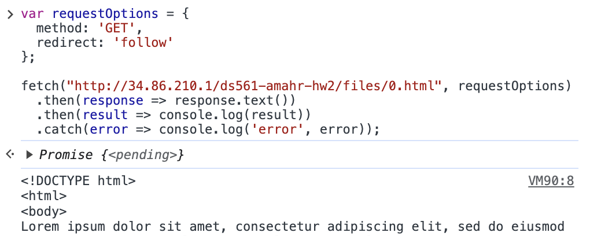

404 Error:
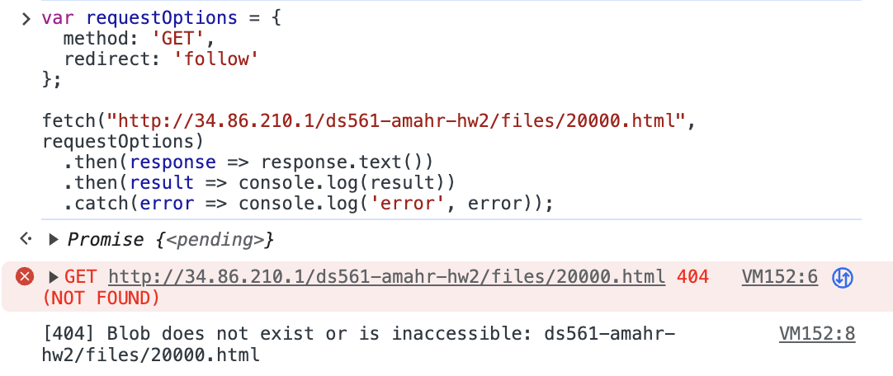
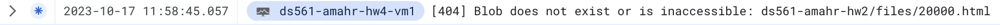

501 Error:
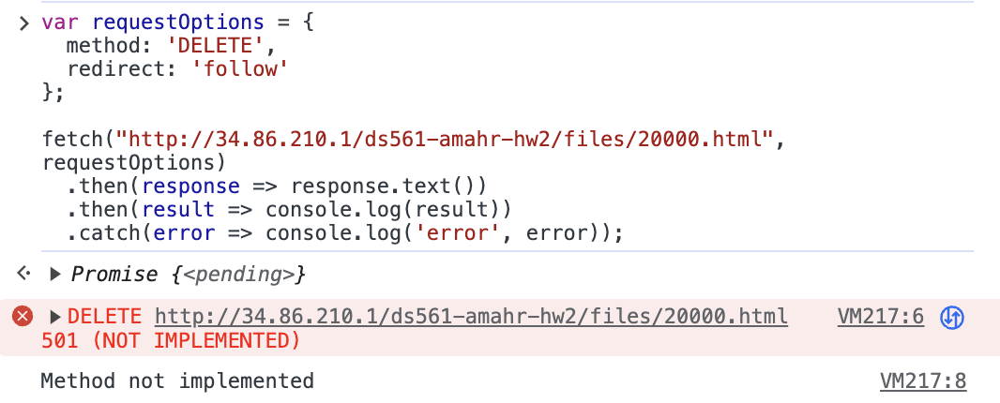


### Part 7

Request:
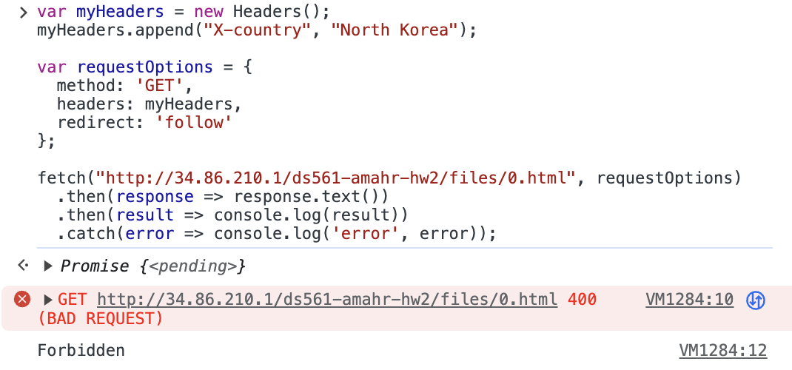

Pub/Sub Subscriber:
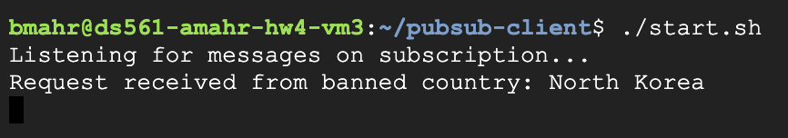

Cloud Logging:


### Part 9

HTTP Client Instances:

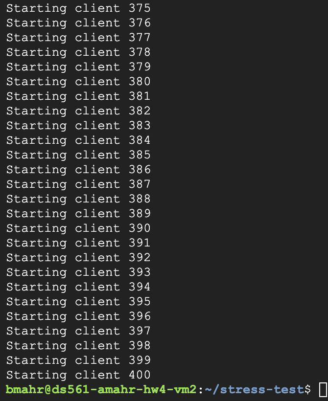

Cloud Logging:
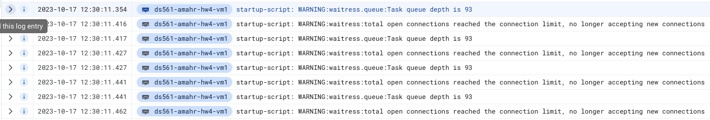

Billing:
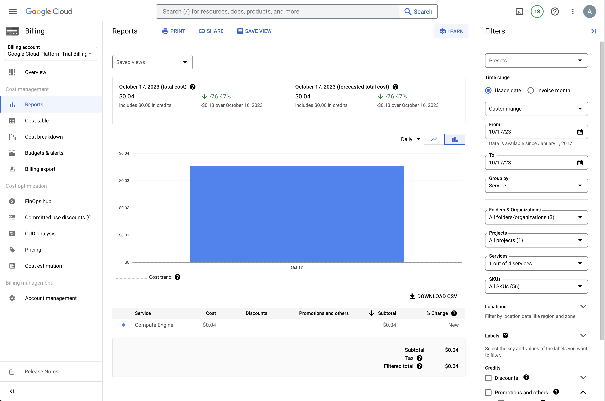
