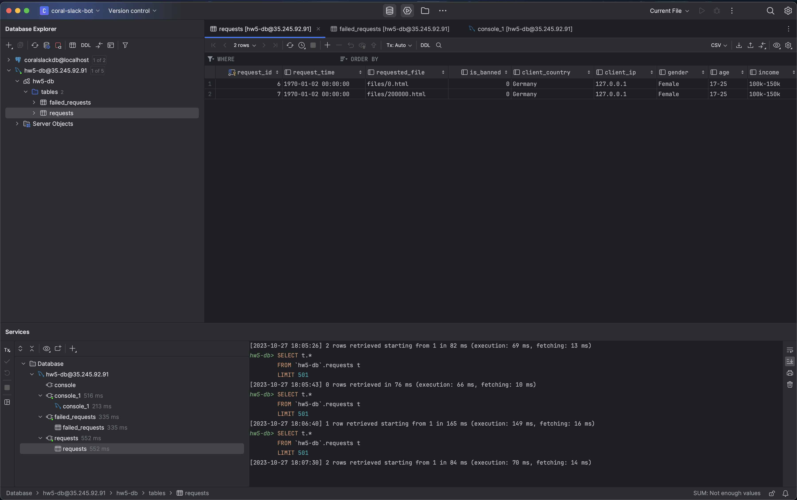

# GCP CloudSQL

Made for CDS DS 561: Cloud Computing  
Professor: [Leonidas Kontothanassis](https://www.bu.edu/cds-faculty/profile/kthanasi/)

---

An example of integrating CloudSQL with a pre-existing Flask app hosted on GCE VMs. The system consists of a Flask app that serves files from a bucket depending on the origin country, a CloudSQL MySQL database that stores various details from each request, and a stress testing VM that sends requests to the Flask app.

## Sections

- [Setup](#setup)
- [Database Schema](#database-schema)
- [Screenshots](#screenshots)
- [Statistics](#statistics)

## Setup

This assignment assumes you have completed homework 4 and still have the stress testing VM. If not, please follow the instructions in the [homework 4 repo](../assignment-4/README.md).

### Steps - General

1. Update `scripts/bash_vars.sh` with the appropriate values. `GCP_PROJECT` and `LINK_FILES_BUCKET_NAME` are the only variables that depend on the previous homeworks.
2. Update `scripts/vm_startup.sh` with the appropriate values. `GCP_PROJECT_ID`, `GCP_PUBSUB_TOPIC_ID`, and all of the `DB` variables come from your `scripts/bash_vars.sh` file.
3. Run `scripts/create_everything.sh` to create the service account, bucket, CloudSQL database instance, and the web server VM. This will also automatically handle the file transfer to the VMs and granting the appropriate permissions to the service account.

### Steps - Stress Testing

1. SSH into your stress testing VM.
2. Upload the HTTP client provided in this repo.
3. Install the necessary dependencies for the HTTP client.
4. Create a bash script to run two instances of the HTTP client with each requesting 50000 files:

```bash
for i in {1..400}
do
    # Run your Python Script on this line with an & at the end
    echo "Starting client $i"
done
```

This is the bash script I used:

```bash
for i in {1..2}
do
    python3 main.py -d 34.145.233.231 -b /ds561-amahr-hw2 -w files -n 50000 -i 10000 -r 1337 &
    echo "Starting client $i"
done
```

5. Run `chmod +x` on the bash script to make it executable.
6. Run the bash script.
7. Log into the CloudSQL instance and run `SELECT COUNT(*) FROM requests;` to see the number of requests that have been made. Wait until the number of requests is at least 100,000. It may be higher due to bot requests.

## Database Schema

`requests` Table:

```sql
CREATE TABLE IF NOT EXISTS requests(
    request_id INT AUTO_INCREMENT PRIMARY KEY,
    request_time TIMESTAMP,
    requested_file VARCHAR(255),
    is_banned BOOLEAN,
    client_country VARCHAR(255),
    client_ip VARCHAR(15),
    gender ENUM("Male", "Female"),
    age ENUM(
        "0-16",
        "17-25",
        "26-35",
        "36-45",
        "46-55",
        "56-65",
        "66-75",
        "76+"
    ),
    income ENUM(
        "0-10k",
        "10k-20k",
        "20k-40k",
        "40k-60k",
        "60k-100k",
        "100k-150k",
        "150k-250k",
        "250k+"
    )
);
```

`failed_requests` Table:

```sql
CREATE TABLE IF NOT EXISTS failed_requests(
    failed_request_id INT AUTO_INCREMENT PRIMARY KEY,
    request_time TIMESTAMP NOT NULL,
    requested_file VARCHAR(255) NOT NULL,
    error_code INT NOT NULL
);
```

## Screenshots

### Part 4

#### Before Requests

`requests` Table:


`failed_requests` Table:


#### 200 Request

cURL:


`requests` Table:


`failed_requests` Table:


#### 404 Request

cURL:


`requests` Table:


`failed_requests` Table:


#### 400 Request

cURL:


`requests` Table:


`failed_requests` Table:


## Statistics

After the database had filled with all 100,000 requests, I ran a few SQL queries to calculate the statistics requested in the assignment. **NOTE:** All of the data was generated by using a random seed of 1337. If you would like to verify, make sure to specify the seed when running your clients.

### How many requests were you able to process successfully vs unsuccessfully?

Answer: 95464 successful requests and 4536 failed requests

```sql
SET @total_req_count = (SELECT COUNT(*) FROM requests);
SET @failed_req_count = (SELECT COUNT(*) FROM failed_requests);

SELECT @total_req_count - @failed_req_count AS SuccessfulReqCount;
SELECT @failed_req_count as FailedReqCount;
```

### How many requests came from banned countries?

Answer: 4536 requests came from banned countries

```sql
SELECT COUNT(*) AS NumOfReqFromBannedCountries FROM requests WHERE is_banned = 1;
```

### How many requests were made by Male vs Female users?

Answer: 49978 were made by male users and 50022 were made by female users
Queries:

```sql
SELECT COUNT(*) AS NumOfMaleReq FROM requests WHERE gender = 'Male';
SELECT COUNT(*) AS NumOfFemaleReq FROM requests WHERE gender = 'Female';
```

### What were the top 5 countries sending requests to your server?

Answer: Niger, Marshall Islands, Ethiopia, Liberia, Malta

```sql
SELECT client_country, COUNT(*) AS NumOfReqs FROM requests GROUP BY client_country ORDER BY NumOfReqs DESC LIMIT 5;
```

### What age group issued the most requests to your server?

Answer: 0-16

```sql
SELECT age, COUNT(*) AS NumOfReqs FROM requests GROUP BY age ORDER BY NumOfReqs DESC LIMIT 1;
```

### What income group issued the most requests to your server?

Answer: 20k-40k

```sql
SELECT income, COUNT(*) AS NumOfReqs FROM requests GROUP BY income ORDER BY NumOfReqs DESC LIMIT 1;
```
