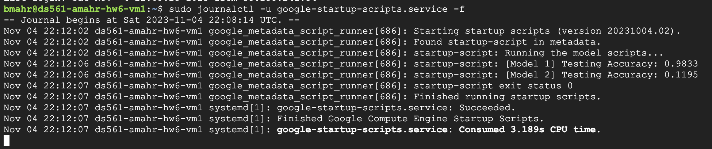

# Data Classification with GCP VMs and CloudSQL

Made for CDS DS 561: Cloud Computing  
Professor: [Leonidas Kontothanassis](https://www.bu.edu/cds-faculty/profile/kthanasi/)

---

An example of exporting data from CloudSQL to be processed with a machine learning model on a VM using Python. The system consists of a CloudSQL MySQL database that stores various details from each request and a VM that runs a Python script to process the data and train a machine learning model.

## Sections

- [Setup](#setup)
- [Explanation](#explanation)
- [Results](#results)

## Setup

This assignment assumes you have completed homework 5 and still have the CloudSQL instance with the `requests` table. If not, please follow the instructions in the [homework 5 repo](../assignment-5/README.md). In addition, the database instance must be running prior to running the `scripts/create_everything.sh` script. This is because the script will attempt to connect to the database instance to create the table.

### Steps

1. Update `scripts/bash_vars.sh` with the appropriate values. `GCP_PROJECT` and everything under the "Cloud SQL" section are the only variables that depend on the previous homeworks.
2. Update `scripts/vm_startup.sh` to reflect the values in `scripts/bash_vars.sh`. `SCRIPT_VM_DIR` can be any directory on the server.
3. Run `scripts/create_everything.sh` to create the bucket and service accounts, upload the files, and create the VM.
4. SSH into the VM and run `sudo journalctl -u google-startup-scripts.service -f` to view the output of the startup script which includes the output of the Python script.

## Explanation

The code is split into four functions: `load_data`, `remove_dupes`, `model_1`, and `model_2`. `load_data` loads in the CSV file exported by the `scripts/create_everything.sh` script. Since gcloud doesn't include the headers when exporting from the CloudSQL instance, it defines those as well. The `remove_dupes` function removes all of the duplicate rows from the dataset. This is done to prevent the duplicated rows from the two clients from being put in both training and testing sets. The `model_1` function trains a decision tree classifier on the `req_ip` column and predicts the `req_country` column. It then outputs the test accuracy score to the startup script. `model_2` does something similar except that it predicts the `req_income` column using every other column in the dataset. It turns out it doesn't matter what columns we include, as the script that originally generated the data did not correlate the header with any other header. In other words, it is an independent variable with a uniform distribution across 8 possible values. This means that the maximum accuracy we can get is 12.5% (1/8). The function then outputs the test accuracy score to the startup script.

A decision tree classifier was used for both due to the problem requiring supervised learning (we have the labels for the data) and the fact that all of the columns within the data are categorial. There are certainly other options like a random forest classifier or a neural network, but a decision tree classifier is simple, quick, and works well for this problem.

## Results

Roughly halfway down the script output you can see that model 1 had an accuracy of 98.33% and model 2 had an accuracy of 11.95% both of which are close to the expected values of 100% and 12.5% respectively.

