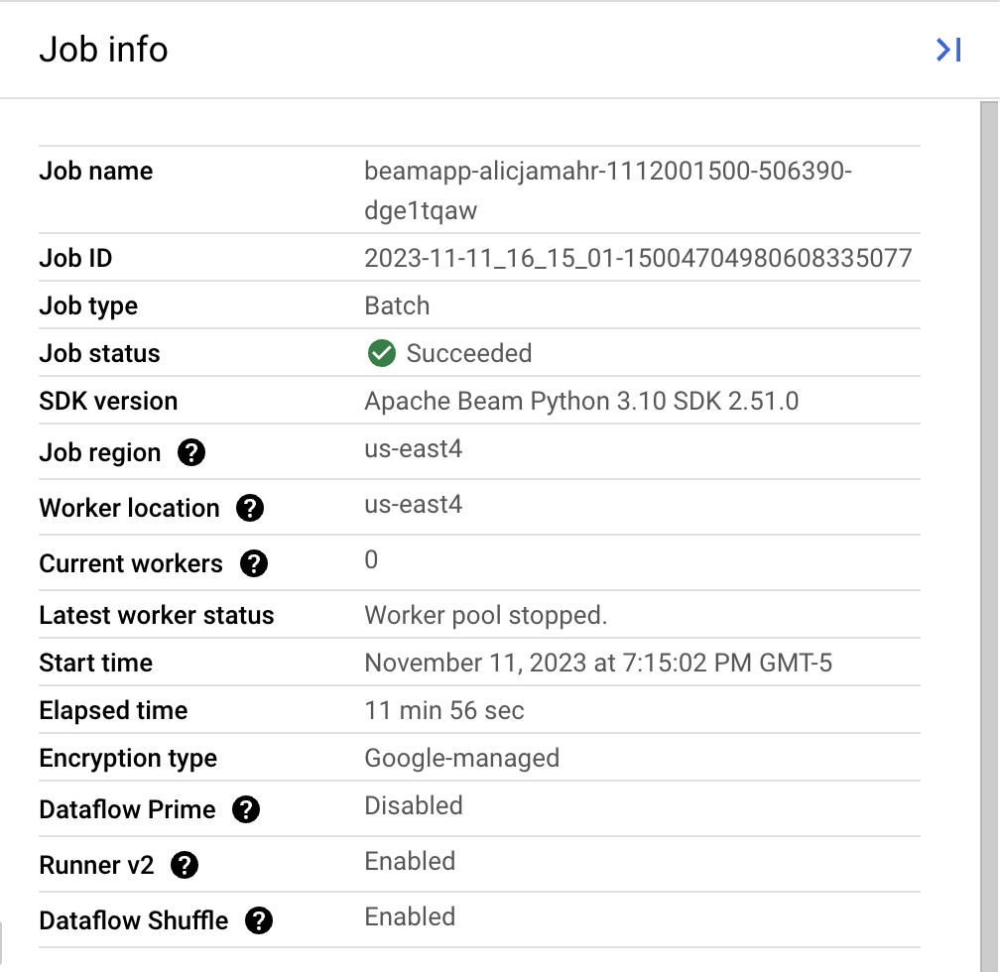
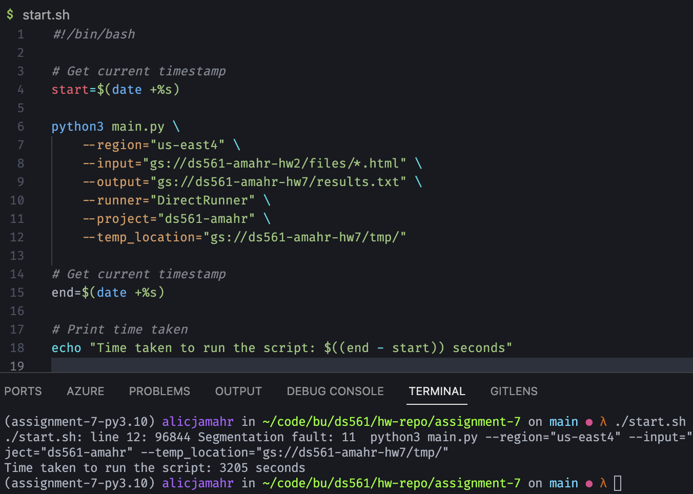

# Apache Beam and GCP Dataflows

Made for CDS DS 561: Cloud Computing  
Professor: [Leonidas Kontothanassis](https://www.bu.edu/cds-faculty/profile/kthanasi/)

---

An example of using Apache Beam to process data from a Cloud Storage bucket to determine various statisitics about the data (incoming and outgoing edges in this case). The system consists of a Cloud Storage bucket that stores the data and a Dataflow job that processes the data before writing it back to another Cloud Storage bucket.

## Sections

- [Setup](#setup)
- [Output](#output)
- [Explanation](#explanation)
- [Runtime](#runtime)

## Setup

This assignment assumes you have completed up to homework 2 and still have the Cloud Storage bucket with the `files` folder. If not, please follow the instructions in the [homework 2 repo](../assignment-2/README.md).

### Steps

1. Install all of the dependencies in `requirements.txt` using `pip install -r requirements.txt`.
2. Create a new Cloud Storage bucket to store the output of the Dataflow job as well as the temp folders
3. Ensure that your GCP project is configured correctly by running the following commands:

```bash
PROJECT_NUMBER=<project-number>
PROJECT_ID=<project-id>

gcloud config set project $PROJECT_ID

for i in dataflow compute_component logging storage_component storage_api bigquery pubsub datastore.googleapis.com cloudresourcemanager.googleapis.com; do gcloud services enable $i; done

for i in roles/dataflow.admin roles/dataflow.worker roles/storage.objectAdmin; do
gcloud projects add-iam-policy-binding "$PROJECT_ID" --member="serviceAccount:$PROJECT_NUMBER-compute@developer.gserviceaccount.com" $i; done
```

4. Update `start.sh` to reflect your locations for `input` and `output` files as well as your `project` name and `region`, the `temp_location` for the Apache Beam job, and the `runner` you want to use (`DataflowRunner` will run it on GCP).
5. Run `start.sh` to start the Dataflow job.

## Output

The raw output files are stored in the `outputs` folder organised by whether they were run locally or through Dataflow as well as whether local files or bucket files were used. For the sake of example, here are the results of running the Dataflow job on the bucket files:

Nodes with the most incoming edges:

```
[(5984, 188), (1912, 166), (5789, 163), (7885, 162), (7231, 162)]
```

Nodes with the most outgoing edges:

```
[(7270, 249), (4431, 249), (3807, 249), (3531, 249), (2911, 249)]
```

## Explanation

My pipeline consists of 5 stages:

1. Read the file names from the input directory
2. Pair the file names with their contents
3. Compute the number of incoming edges for each node
4. Compute the number of outgoing edges for each node
5. Write the results to a shared file

For step 1, `fileio.MatchFiles` was used to pull the names for every file within the input directory. `fileio.ReadMatches` converts the result of `MatchFiles` into a `PCollection` which we then use `Reshuffle` on to allow them to be processed independently of one another.

For step 2, we `Map` the path of each file to the contents by calling the `read` function on the `FileIO` object.

For step 3, we use RegEx to extract each of the file IDs from the file contents, convert them to ints for cleanliness, and then use `Count.PerElement` to count the number of times each ID appears. We then use `Top.Of` to get the top 5 nodes with the most incoming edges.

For step 4, we use splicing to extract each file's name before converting it to an int. We then pair that with the number of HREF tags within the file (found using RegEx). We then take the top 5 nodes with the most outgoing edges.

For step 5, we `Flatten` the two `PCollections` together and write them to a file using `WriteToText`

## Runtime

The Dataflow job took around 11 minutes while running locally using bucket files took roughly 53 minutes. Running locally on local files takes around 20 seconds.



