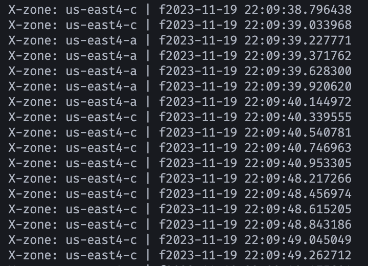
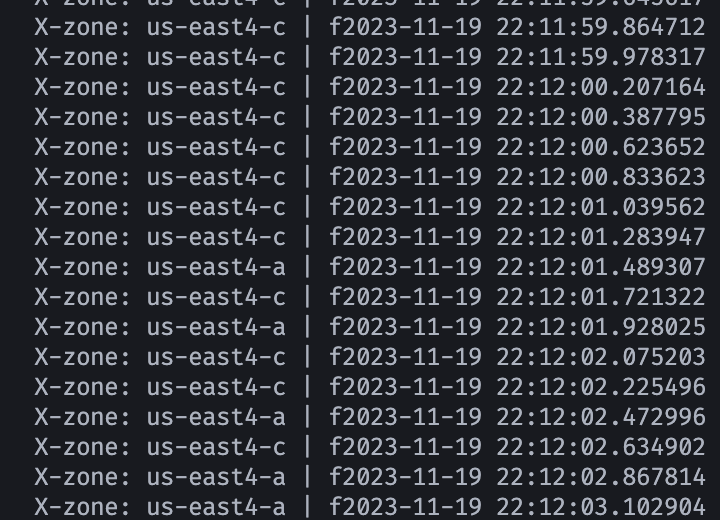
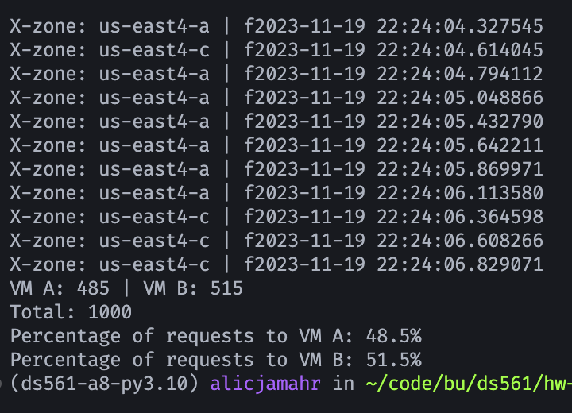

# GCP Load Balancers and VMs

Made for CDS DS 561: Cloud Computing  
Professor: [Leonidas Kontothanassis](https://www.bu.edu/cds-faculty/profile/kthanasi/)

---

An example of using GCE VMs and a network load balancer to create a highly available distributed system. The system consists of two web servers within different zones of the same region. A network load balancer is used to distribute traffic between the two servers, including handling health checks and automatically removing unhealthy servers from the pool.

## Sections

- [Setup](#setup)
- [Results](#results)

## Setup

### Prerequisites

This assignment assumes you have completed homework 2 and have the generated files available in a GCP bucket. If not, please refer to the [Homework 2 README](../assignment-2/README.md) for instructions on how to generate the files and upload them to a bucket.

### Steps

1. Update `scripts/bash_vars.sh` with the appropriate values. `GCP_PROJECT` and `LINK_FILES_BUCKET_NAME` are the only variables that depend on the previous homeworks.
2. Update `scripts/vm1_startup.sh` and `scripts/vm2_startup.sh` with the appropriate values. `WEB_SERVER_GCP_BUCKET` comes from `scripts/bash_vars.sh`. `ZONE` is the zone for the VM as specified in `scripts/bash_vars.sh`.
3. Run `scripts/create_everything.sh` to create the VMs and load balancer.
4. Run the `http-client.py` script to test the load balancer.
   ```bash
   python3 http-client.py -d <load-balancer-ip> -b <bucket-name> [-w <bucket-subdir-name>] -n <number-of-files> -i <total-number-of-files> [-v]
   ```
5. (After testing) Run `scripts/delete_everything.sh` to delete the VMs and load balancer.

## Results

### Shutdown VM 1 (us-east4-a)

After killing VM 1, the load balancer removed it from the pool and traffic was rerouted to VM 2 (us-east4-c). There was an 8 second delay between the VM being killed and the load balancer removing it from the pool, but no errors were returned by the client.



### Restart VM 1 (us-east4-a)

After restarting VM 1, the load balancer added it back to the pool and traffic was distributed between the two VMs. There was roughly a 10 second delay between the VM being restarted and the load balancer adding it back to the pool, and no errors were returned by the client.



### Request Distribution

The load balancer distributed requests between the two VMs relatively fairly with a 1.5% difference in the number of requests handled by each VM.


