# GKE and GCP Pub/Sub

Made for CDS DS 561: Cloud Computing  
Professor: [Leonidas Kontothanassis](https://www.bu.edu/cds-faculty/profile/kthanasi/)

---

An example of using GKE and GCP Pub/Sub to create a scalable web server. This assignment is a continuation of [Homework 4](../assignment-4/README.md). The goal is to dockerise the web server from Homework 4 and maintain the same functionality by closing the air gap between GKE and GCS. This assignment consists of two components: a GKE cluster containing the deployed web server and a GCP Pub/Sub topic and subscription to transmit information between the web server and a subscriber.

## Sections

- [Setup](#setup)
- [Screenshots](#screenshots)

## Setup

### Prerequisites

This assignment assumes your local computer has `gcloud` installed and authenticated. It also assumes you have completed the previous homeworks and have the files available for manual upload to the stress testing VM (hereby VM 2) and the subscriber VM (hereby VM 3).

### Steps - General

1. Update `scripts/utils/bash_vars.sh` with the appropriate values. `GCP_PROJECT` and `LINK_FILES_BUCKET_NAME` are the only variables that depend on the previous homeworks. `GCP_SA_EMAIL` is the email associated with the default compute service account for your project.
2. Update the env vars in `app/Dockerfile` to reflect your project's ID (`PROJECT_ID`) and the name of the topic you specified in `scripts/utils/bash_vars.sh` (`TOPIC_ID`).
3. Run `scripts/create_everything.sh` to create a Pub/Sub topic and subscription, update the service account's permissions, create a container registry, build and push the container, create a GKE cluster, deploy the container to the cluster, and create a VM for the subscriber.

### Steps - Subscriber VM

1. SSH into the subscriber VM.
2. Upload the contents of `sub-client` to the VM.
3. Install the necessary dependencies for the Pub/Sub subscriber. You may need to install pip (`sudo apt update && sudo apt install python3-pip -y`).
4. Run the subscriber, passing in the project and subscription IDs as arguments.

### Steps - HTTP Client VM

1. SSH into the HTTP client VM.
2. Upload the contents of `http-client` to the VM.
3. Install the necessary dependencies for the HTTP client. You may need to install pip (`sudo apt update && sudo apt install python3-pip -y`).
4. Run the HTTP client:
   ```bash
   python3 http-client.py -d <k8s-lb-ip> -b <bucket-name> [-w <bucket-subdir-name>] -n <number-of-files> -i <total-number-of-files> -s [-v]
   ```

## Screenshots

### Part 4

For the sake of time (and my lack of screen space), I only requested 5 files and did not include the `-v` flag.

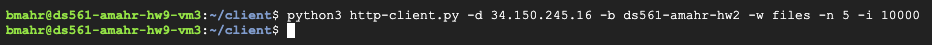

To request hundreds of files as stated, the following version of the command could be used:

```bash
python3 http-client.py -d 34.150.245.16 -b ds561-amahr-hw2 -w files -n 300 -i 10000
```

### Part 5

404 Error:
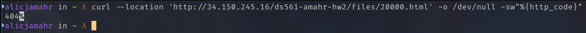
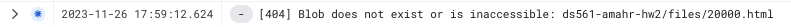

501 Error:
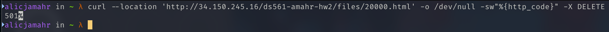
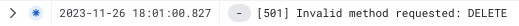

### Part 6

200 Response:
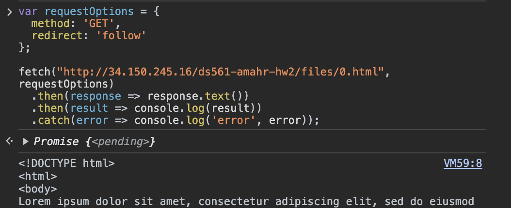

404 Error:
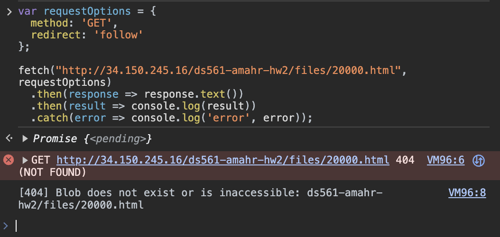
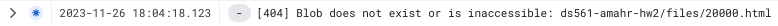

501 Error:
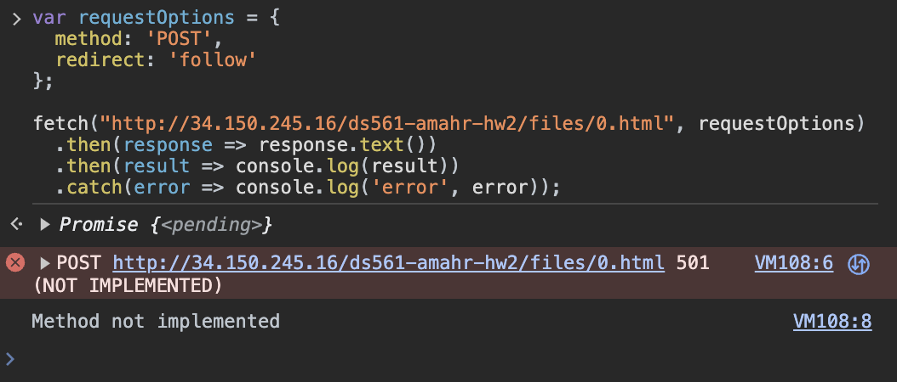


### Part 7

Request:
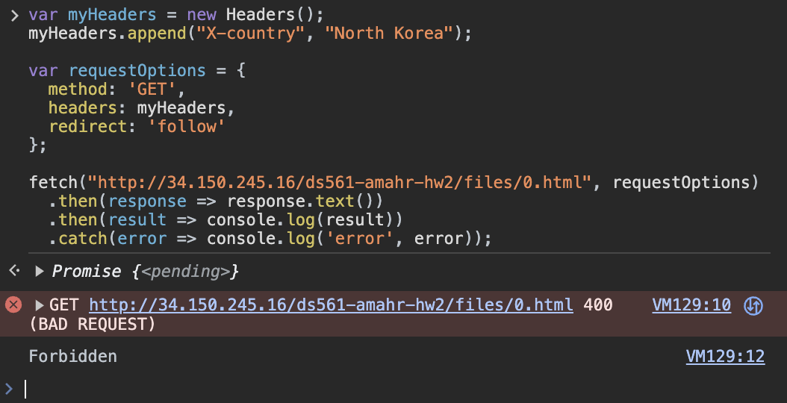

Pub/Sub Subscriber:
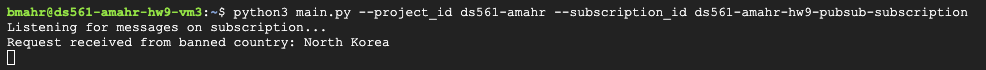

Cloud Logging:


### Part 9

Deployment Console View:
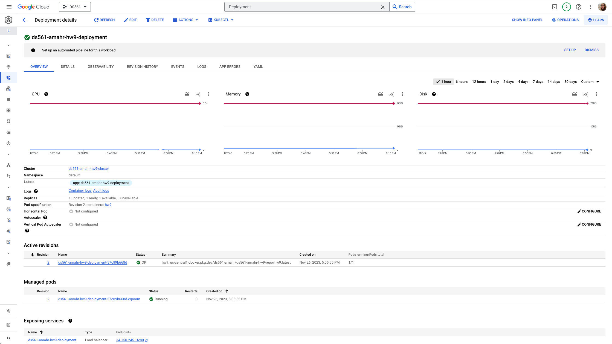
